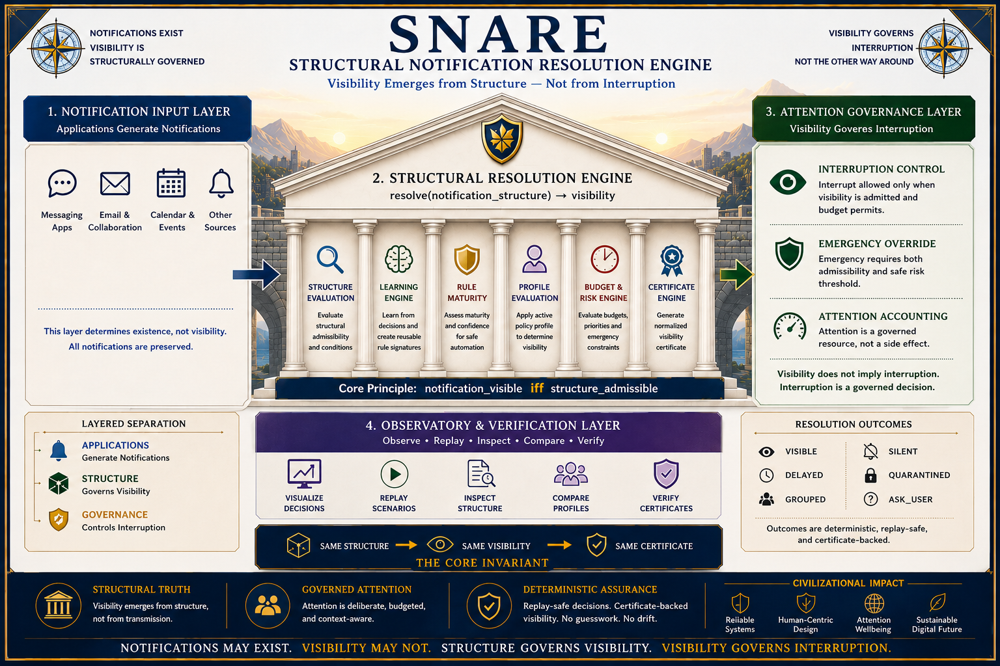

# ⭐ **SNARE**

## **Structural Notification Resolution Engine**

### **Notification visibility through structural admissibility rather than application-defined interruption rules**


---

**Why should every notification become visible simply because it exists?**

SNARE explores whether notification visibility can be governed through structure rather than application-specific interruption logic.

Traditional systems often assume:

`notification -> application rules -> visibility`

SNARE explores:

`notification -> structural admissibility -> visibility`

Core invariant:

`notification_visible iff structure_admissible`

---

# 🔍 **Positioning & Scope**

SNARE is a structural notification governance demonstration framework.

It explores whether notification visibility can be determined through structure rather than application-defined notification pipelines.

SNARE does **not** replace:

- operating systems
- notification services
- messaging platforms
- calendars
- communication systems

Instead, SNARE explores a narrower question:

**Can notification visibility be structurally governed before interruption occurs?**

The demonstrations are intentionally designed to be:

- deterministic
- replayable
- inspectable
- explainable
- auditable

SNARE complements existing notification systems.

It is not intended to replace them.

---

# ⚡ **The Core Principle**

Traditional:

`notification_exists -> show_notification`

SNARE:

`notification_visible iff structure_admissible`

Visibility becomes a structural decision.

Existence alone is insufficient.

---

# 🧩 **Structural Resolution Model**

SNARE resolves notifications into deterministic visibility states.

Possible outcomes:

- VISIBLE
- SILENT
- DELAYED
- GROUPED
- QUARANTINED
- ASK_USER

The system never deletes notifications.

The system governs visibility.

---

## **Notification Preservation**

SNARE does not delete notifications.

Core invariant:

`event_exists != event_visible`

A notification may exist without becoming interruptible.

A notification may be:

- visible
- silent
- delayed
- grouped
- quarantined

while remaining preserved within the system.

Visibility is governed.

Existence is preserved.

---

# 🔁 **Learning Model**

Unknown structure becomes:

`first_unknown -> ask_user`

User decisions become:

`user_decision -> structural_rule`

Repeated observations become:

`structural_rule -> mature_rule`

Core invariant:

`rule_active iff confidence >= threshold AND conflicts = 0`

---

# 🧠 **Rule Maturity**

SNARE distinguishes between:

- ACTIVE
- PENDING
- CONFLICTED

Only mature rules may automatically govern future visibility.

Conflicted rules remain visible and require user resolution.

---

# ⚡ **Attention Governance**

Visibility and interruption are separate concepts.

A notification may be:

`VISIBLE`

without being:

`INTERRUPTIBLE`

Core invariant:

`interrupt_allowed iff state = VISIBLE AND priority >= threshold AND budget_available`

This allows visibility without attention overload.

---

# 🚨 **Emergency Resolution**

Emergency notifications are not automatically granted interruption.

Emergency visibility remains structurally governed.

Core invariant:

`emergency_interrupt_allowed iff emergency = true AND risk <= safe_limit`

Risky emergencies remain blocked.

Safe emergencies may override attention budgets.

---

# 🧩 **Policy Profiles**

The same notification structure may be evaluated under multiple deterministic profiles.

Included profiles:

- DEFAULT
- FOCUS_MODE
- WORK_MODE
- FAMILY_MODE
- SLEEP_MODE

Core invariant:

`visibility_resolution = resolve(event_structure, active_policy_profile)`

Structure remains unchanged.

Only visibility policy changes.

---

# 📊 **Profile Comparison**

SNARE compares notification outcomes across multiple profiles.

Core invariant:

`profile_difference = resolve(event, profile_a) != resolve(event, profile_b)`

This allows visibility behavior to be inspected without modifying notification structure.

---

# 📈 **Attention Ledger**

SNARE includes a deterministic attention accounting model.

Core invariant:

`attention_spent = sum(interruptions_granted)`

The ledger allows comparison of:

- interruptions requested
- interruptions granted
- interruptions held
- emergency overrides
- relative attention load

across multiple profiles.

---

# ⚡ **90-Second Structural Proof**

Generate outputs:

```
python demo/snare_learning_demo_v1_0.py --out_dir outputs
```

Open observatory:

```
python -m http.server 8000
```

Open:

`http://localhost:8000/SNARE_v1_0.html`

Expected:

- deterministic notification resolution
- structural learning
- rule maturity
- interruption governance
- emergency handling
- profile comparison
- attention ledger visibility

---

# 🚀 **Quick Start**

Generate demonstration outputs:

```
python demo/snare_learning_demo_v1_0.py --out_dir outputs
```

Open local server:

```
python -m http.server 8000
```

Open observatory:

`http://localhost:8000/SNARE_v1_0.html`

---

# 🌐 **Interactive Notification Observatory**

SNARE includes a fully offline interactive observatory.

The observatory demonstrates:

- notification resolution
- structural learning
- mature rules
- conflicted rules
- interruption budgets
- emergency overrides
- policy profiles
- profile comparison
- attention accounting

Browser Console:

`setSample(0)`

`setSample(1)`

`setSample(2)`

`setSample(3)`

`resetBudget()`

Expected:

- deterministic visibility states
- explainable decisions
- replayable outcomes
- structural consistency

---

# 🔐 **Deterministic Invariants**

`same structure -> same resolution`

`same structure -> same certificates`

`same structure -> same visibility`

`same structure -> same interruption outcome`

---

## **Replayability**

SNARE decisions are replayable.

Core invariant:

`same structure -> same resolution -> same certificate`

Replay validation allows:

- auditability
- explainability
- deterministic verification
- reproducible outcomes

The same notification structure produces the same visibility outcome across repeated executions.

---

# 🧾 **Structural Vocabulary**

| Symbol | Meaning |
|----------|----------|
| `VISIBLE` | visible notification |
| `SILENT` | visible suppression |
| `DELAYED` | deferred visibility |
| `GROUPED` | grouped visibility |
| `QUARANTINED` | risk blocked |
| `ASK_USER` | unknown structure |
| `ACTIVE` | mature rule |
| `CONFLICTED` | unresolved rule conflict |
| `certificate` | deterministic decision identity |

---

# 🧭 **Architecture**



SNARE explores notification governance as:

notification

↓

structure

↓

resolution

↓

visibility

↓

attention

The focus is not notification delivery.

The focus is structural visibility governance.

---

# ⚠️ **Scope & Boundaries**

SNARE does **not** claim:

- operating system replacement
- notification platform replacement
- messaging platform replacement
- universal interruption correctness
- production deployment certification

SNARE demonstrates:

- deterministic notification resolution
- structural learning
- mature rule activation
- interruption governance
- emergency handling
- policy comparison
- attention accounting
- replayable decisions

---

# 🖥️ **Observatory Quickstart**

**Windows**

```
python demo/snare_learning_demo_v1_0.py --out_dir outputs
```

```
python -m http.server 8000
```

Open:

`http://localhost:8000/SNARE_v1_0.html`

---

**macOS / Linux**

```
python3 demo/snare_learning_demo_v1_0.py --out_dir outputs
```

```
python3 -m http.server 8000
```

Open:

`http://localhost:8000/SNARE_v1_0.html`

Modern browsers restrict direct `file://` execution.

The local server step is therefore recommended.

---

# 📂 Documentation

- [Quickstart](docs/Quickstart.md)
- [FAQ](docs/FAQ.md)
- [Structural Resolution Guarantees](docs/SNARE-Resolution-Guarantees.md)
- [SNARE Architecture Notes](docs/SNARE-Architecture-Notes.md)
- [SNARE Challenge](docs/SNARE-Challenge.md)

## 🧩 SNARE Architecture

- [SNARE Architecture Diagram](docs/SNARE-Diagram.png)

## 🏛️ Foundational Framework

- [Dependency Elimination Framework](docs/Dependency-Elimination-Framework.png)
- [Shunyaya Structural Stack](docs/Shunyaya-Structural-Stack.png)

### **Verification Artifacts**

- [SNARE Verification](VERIFY/VERIFY.txt)
- [Freeze Hashes](VERIFY/FREEZE_DEMO_SHA256.txt)

### **Reference Outputs**

- Initial Resolution Report
- Future Resolution Report
- Mature Rules
- Profile Comparison Report
- Attention Ledger

Each report is provided in:

- CSV format
- JSON format

within the `outputs/` directory.

---

# 🔥 **Break SNARE**

Attempt:

- same structure -> different resolution
- same structure -> different certificate
- mature rule -> inconsistent outcome
- safe emergency -> blocked incorrectly
- conflicted rule -> automatic activation

Invariant under test:

`same structure -> same visibility outcome`

---

# 📜 **License**

See: [LICENSE](LICENSE)

### **Reference Implementation (This Repository)**

Released under the Open Standard Reference License.

Free to use, study, implement, extend, validate, and deploy.

### **Architecture and Documentation**

CC BY-NC 4.0

---

# 🧭 **Roadmap**

Near-term:

- larger notification datasets
- richer policy profiles
- stronger conflict analysis
- profile recommendation systems
- improved attention accounting
- expanded observatory scenarios

Long-term:

- multi-device demonstrations
- enterprise notification governance
- calendar integration demonstrations
- structural attention ecosystems

SNARE evolves through:

notification

↓

resolution

↓

learning

↓

visibility

↓

attention

---

# 🧠 **Core Observation**

Notifications do not become important because they exist.

Notifications become visible when structure admits visibility.

SNARE explores visibility governance as a structural decision rather than an interruption default.

---

## **Structural Question**

SNARE explores a simple question:

`must notification visibility be application-defined?`

or can:

`notification_visibility -> emerge_from_structure`

The reference implementation explores this question through deterministic resolution, learning, policy profiles, interruption governance, and replayable outcomes.

---

---

# 🏛️ Historical Foundation (SMAIRE)

SNARE builds upon earlier structural governance explorations.

One predecessor was:

**SMAIRE — Structural SMS Admissibility & Integrity Resolution Engine**

SMAIRE explored a narrower question:

`structure -> admissibility -> delivery`

Core invariant:

`message_delivered iff message_admissible`

SNARE extends the structural direction toward:

`notification -> structure -> visibility -> attention`

Where SMAIRE explored:

**Should delivery occur?**

SNARE explores:

**Should visibility occur?**

and

**Should interruption occur?**

A compact preservation of the original SMAIRE reference implementation,
diagrams, and historical materials is available under:

[historical_foundation/](historical_foundation/)

---

# 🌌 **Final Insight**

Notifications may exist.

Visibility may not.

SNARE explores whether notification visibility can be structurally governed before interruption occurs.

**This is structural notification resolution.**

**This is SNARE.**
