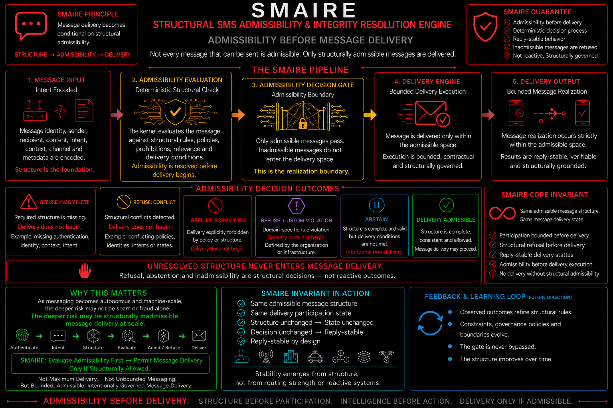

# 🏛️ **Historical Foundation — SMAIRE**

## **Structural SMS Admissibility & Integrity Resolution Engine**

### **Admissibility before message delivery**

SMAIRE is preserved here as historical foundation material for SNARE.

It explores a related structural governance question:

**Should message delivery occur at all?**

Core direction:

`structure -> admissibility -> delivery`

Core invariant:

`same messaging structure -> same message delivery state`

---

# 📜 **Historical Context**

SMAIRE is preserved here because it explores a related structural question:

**Should delivery occur at all?**

SMAIRE:

`structure -> admissibility -> delivery`

SNARE:

`notification -> structure -> visibility -> attention`

Both explore structure-first governance before realization occurs.

---

# 🔍 **Purpose**

SMAIRE explored whether message delivery can be governed by structural admissibility before delivery begins.

Traditional messaging systems often assume:

`send -> route -> deliver`

SMAIRE explored:

`structure -> admissibility -> delivery`

The shift is simple:

**not every message that can be sent should be delivered.**

---

# 🧩 **Core Principle**

SMAIRE treats delivery as conditional on structural admissibility.

Core principle:

`message_delivered iff message_admissible`

Within the reference kernel, admissibility is resolved before delivery proceeds.

If the structure is incomplete, conflicted, forbidden, or intentionally withheld, delivery does not begin.

---

# ⚙️ **Reference Kernel**

This folder includes a minimal deterministic Python kernel:

`smaire_kernel.py`

Run:

```
python smaire_kernel.py
```

Expected output:

`SMS_ADMISSIBLE`

`REFUSE: FORBIDDEN`

`REFUSE: CONFLICT`

`REFUSE: INCOMPLETE`

`ABSTAIN`

The kernel is intentionally small.

It is not a telecom system.

It is not a messaging platform.

It is a structural admissibility demonstration.

---

# 🧠 **Resolution States**

SMAIRE resolves message delivery into deterministic states:

| State | Meaning |
|---|---|
| `SMS_ADMISSIBLE` | Structure is complete, consistent, and delivery may proceed |
| `ABSTAIN` | Structure may be valid, but delivery is intentionally withheld |
| `REFUSE: INCOMPLETE` | Required delivery structure is missing |
| `REFUSE: CONFLICT` | Structural contradiction exists |
| `REFUSE: FORBIDDEN` | Delivery is explicitly prohibited |
| `REFUSE: CUSTOM_VIOLATION` | Domain-specific admissibility rule failed |

---

# 🔁 **Priority Ordering**

The reference kernel evaluates structural conditions in a deliberate order:

1. `FORBIDDEN`
2. `CONFLICT`
3. `ABSTAIN`
4. `INCOMPLETE`
5. `CUSTOM_VIOLATION`
6. `SMS_ADMISSIBLE`

This means harder structural violations override softer delivery states.

Example:

`conflict = true`

and

`abstain = true`

resolves to:

`REFUSE: CONFLICT`

not:

`ABSTAIN`

---

# 🔐 **Deterministic Invariant**

SMAIRE explores replay-stable message delivery admissibility.

Core invariant:

`same messaging structure -> same message delivery state`

If the structure does not change, the delivery state should not change.

This applies to both admissible and inadmissible states.

---

# 🧭 **Architecture**



SMAIRE explores a five-step pipeline:

1. **Message Input**
2. **Admissibility Evaluation**
3. **Admissibility Decision Gate**
4. **Delivery Engine**
5. **Delivery Output**

The central architectural boundary is:

**admissibility before delivery**

---

# 🧱 **What SMAIRE Demonstrates**

SMAIRE demonstrates:

- structural admissibility before delivery
- deterministic message delivery states
- refusal as a structural outcome
- abstention as intentional non-delivery
- replay-stable delivery behavior
- custom rule extension
- bounded delivery posture

---

# 🚫 **What SMAIRE Does Not Claim**

SMAIRE does **not** claim:

- universal messaging security
- perfect protection
- spam elimination
- telecom infrastructure replacement
- messaging protocol replacement
- authentication replacement
- production deployment certification

SMAIRE is a bounded structural demonstration.

Its safety depends on the correctness, completeness, and governance quality of the admissibility structure supplied to the kernel.

---

# 🌐 **Position Within the Shunyaya Ecosystem**

SMAIRE was originally conceived as part of a broader family of structure-first systems.

Examples include:

- AIR — admissibility before autonomy
- SURE — structural generation and resolution
- STARR — representation admissibility
- SWAIRE — participation admissibility before connectivity
- SMAIRE — message delivery admissibility

Together these systems explored the idea that realization may be preceded by structural evaluation.

---

# 🔗 **Relationship to SNARE**

SMAIRE and SNARE explore related structural governance questions in different domains.

SMAIRE asks:

**Should delivery occur?**

SNARE asks:

**Should visibility occur?**

and:

**Should interruption occur?**

Relationship:

`message -> delivery admissibility -> notification -> visibility -> attention`

SMAIRE focused on:

`structure -> admissibility -> delivery`

SNARE extends the direction toward:

`notification -> structure -> visibility -> attention`

---

# 📌 **Why SMAIRE Is Preserved Here**

SMAIRE is included in this repository only as historical foundation material.

It helps show the conceptual path from:

**structural delivery governance**

toward:

**structural visibility and attention governance**

SNARE remains the primary active reference implementation in this repository.

---

# 📂 **Files**

This folder contains:

- `README.md`
- `smaire_kernel.py`
- `SMAIRE-Diagram.png`

---

# 🧪 **Try It**

Run:

```
python smaire_kernel.py
```

Then modify the input structure.

Examples:

- add `abstain: True`
- add `forbidden: True`
- add `conflict: True`
- remove `delivery_authorization`
- add a custom check returning `REFUSE: CUSTOM_VIOLATION`

Observe how the delivery state changes.

The important shift is:

`message delivery becomes structurally bounded before delivery begins`

---

# 🧠 **Core Observation**

The safest message may sometimes be the message that refuses to deliver.

Not because refusal alone creates safety.

But because structurally inadmissible delivery should not automatically materialize.

---

# 🔥 **Final Line**

SMAIRE explored:

`structure -> admissibility -> delivery`

SNARE extends the direction toward:

`notification -> structure -> visibility -> attention`

**Delivery may be governed.**

**Visibility may be governed.**

**Attention may be governed.**

**Structure remains the common foundation.**
